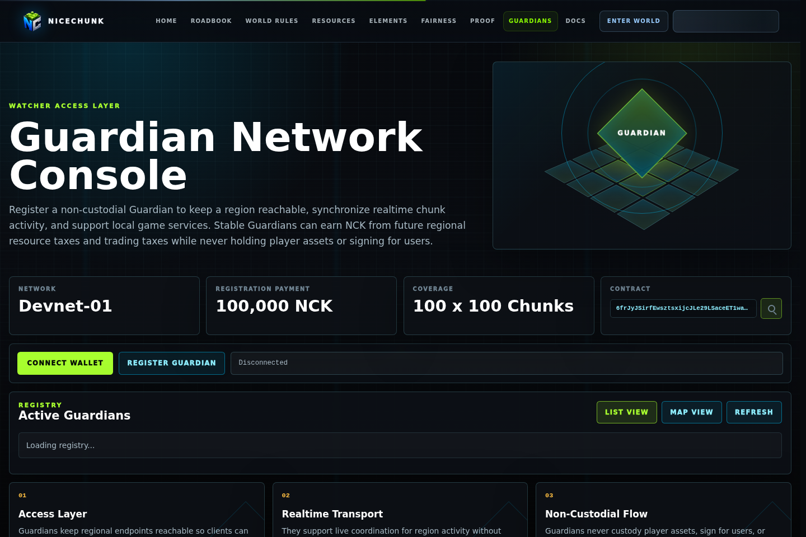
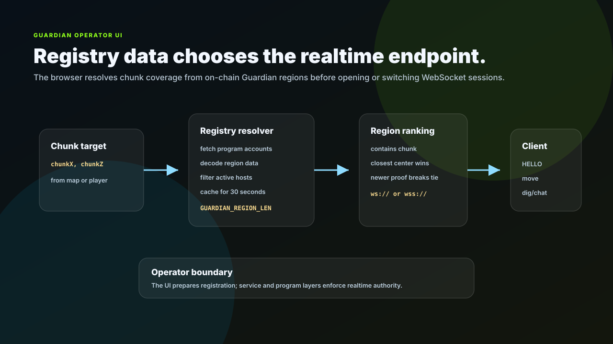

# NiceChunk Guardian Web

Web interface for Guardian registry inspection and registration workflows.

## Project Overview

This repository contains the browser interface for interacting with the Guardian registry. It allows developers and operators to inspect the current Guardian program, connect a wallet, preview region ownership, and prepare registration flows.

The UI is separate from the C++ Guardian service because it serves a different role. It is an operator-facing control surface, not the realtime node itself.

The page uses the same SDK and RPC configuration conventions as the main web client so registry data and region coverage can be tested consistently.

## Registry Resolution

The web UI resolves Guardian coverage from on-chain region accounts. It fetches registry accounts, decodes active regions, filters by chunk bounds, ranks matching Guardians by distance and proof freshness, then normalizes a `ws` or `wss` endpoint for the realtime client.

That flow gives operators and client developers the same mental model: chunks are not routed to a hardcoded server unless the registry cannot provide a match. The UI remains an operator surface for registration and inspection; the realtime server and registry program remain the enforcement layers.

## System Principles

- Operator clarity: registration inputs, program IDs, treasury accounts, and region previews should be visible before a wallet signs anything.
- Registry-first discovery: Guardian coverage is read from the on-chain registry instead of hardcoded endpoint assumptions.
- Shared integration code: the UI reuses the Guardian SDK and registry resolver used by the game client.
- English-first development: the interface should be documented and validated in English before locale expansion.

## How It Works

- Open the Guardian page in a Vite dev server and connect a compatible Solana wallet.
- Inspect the current program ID, global configuration PDA, and region preview before preparing a transaction.
- Use the registry resolver code to understand how the main client maps a chunk to a Guardian endpoint.
- Keep UI changes aligned with any Guardian program layout changes.

## Why This Project Matters

Guardian operation must be approachable. This repository turns a low-level registry program into an interface operators can reason about.

Separating the web UI also makes it easier to build future dashboards without coupling them to the playable client.

## Repository Layout

- `guardian/`
- `src/guardianRegistry.js`
- `src/guardianClient.js`
- `sdk/`

## Development Workflow

1. Clone the repository and inspect the focused source tree before changing shared contracts or generated artifacts.
2. Keep changes scoped to the domain of this repository. Cross-domain changes should be coordinated through the matching split repositories.
3. Run the smallest meaningful validation for the touched surface: build checks for programs, browser checks for pages, or fixture checks for deterministic libraries.
4. Update screenshots and documentation when behavior, visible UI, public constants, or developer-facing workflows change.

## Future Development Direction

- Add historical proof and uptime views for registered regions.
- Provide dry-run transaction previews and fee estimates.
- Add region conflict visualization and neighboring Guardian awareness.
- Expose operator health checks once the server exports stable metrics.

## Maintenance Notes

This repository is a focused split from the main NiceChunk working tree. Keep the public surface explicit: avoid committing private keys, wallet files, deployment-only scripts, machine-specific configuration, or generated build artifacts. Runtime user-facing copy should stay behind the i18n layer where the project has an i18n surface.
